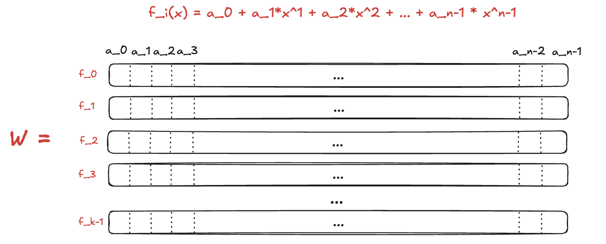
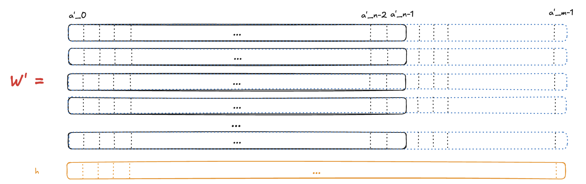
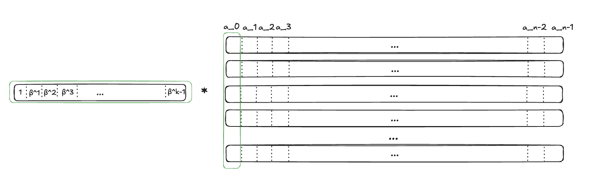
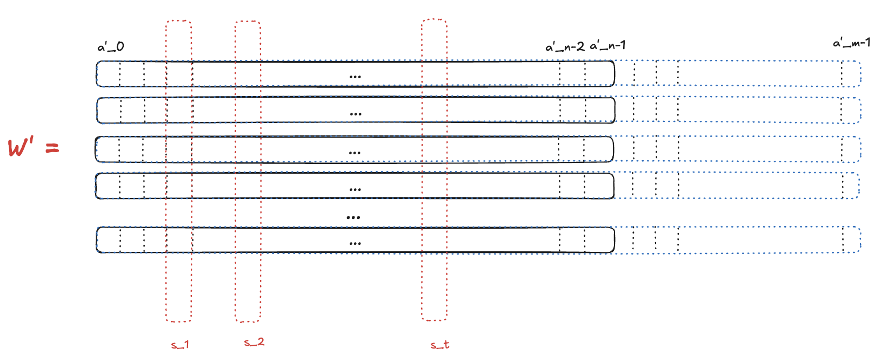

# Vortex PCS Rust implementation

[](https://opensource.org/licenses/MIT)
[](https://github.com/distributed-lab/vortex-rs/issues)
<a href="https://github.com/distributed-lab/vortex-rs">

</a>

⚠️ __Please note - this crypto library has not been audited, so use it at your own risk.__

## Abstract

This implementation leverages Poseidon2 hash function for Merkle tree and RingSIS hash implementation (it has been
rewritten
from [Gnark's implementation](https://github.com/Consensys/gnark-crypto/blob/master/field/koalabear/sis/sis.go)) for
hashing columns. On the x86 architecture which enables AVX optimization the implementation leverages dynamic RingSIS
library compiled from Go version mentioned above. It also leverages KoalaBear prime field and its 4-degree extension.
The field, Poseidon2 and DFT implementations are taken from [Plonky3](https://github.com/Plonky3/Plonky3) repository.

The original paper can be found [here](https://eprint.iacr.org/2024/185).

Note, the brunch [poseidon2-edition](https://github.com/distributed-lab/vortex-rs/tree/poseidon2-edition) contains
implementation that leverages on only Poseidon2 hash for both column hashing and Merkle tree.

## Usage

The following parameters have to be set up:

```rust
pub struct VortexParams {
    perm: PoseidonHash, // An instance of PoseidonHash
    r_sis: RSis, // An instance of RingSis hash
    nb_row: usize, // Number of rows in commitment matrix
    nb_col: usize, // Number of columns or a polynomial degree
    rs_rate: usize, // Reed-Solomon code rate
    num_columns_to_open: usize, // Number of columns to open in the opening phase
}
```

Use the following functions to commit/evaluate/open and verify:

1. Commit
   ```rust
      pub fn commit(params: &VortexParams, w: Vec<Vec<KoalaBear>>) -> (MerkleTree, Vec<Vec<KoalaBear>>)
    ```
2. Eval
   ```rust
      pub fn eval(params: &VortexParams, w: &Vec<Vec<KoalaBear>>, coin: KoalaBearExt) -> Vec<KoalaBearExt>
    ```
3. Open
   ```rust
      pub fn open(params: &VortexParams, w: &Vec<Vec<KoalaBear>>, w_: &Vec<Vec<KoalaBear>>, mt: &MerkleTree, beta: KoalaBearExt, column_ids: Vec<usize>) -> OpenProof
    ```
4. Verify proof
   ```rust
      pub fn verify(params: &VortexParams, proof: OpenProof, root: Digest, y: Vec<KoalaBearExt>, coin: KoalaBearExt)
    ```

The verification function asserts if proof is invalid. The implementation is fixed over KoalaBear field and its
4-degree extension. Check tests in [lib.rs](./src/lib.rs) for more details.

## Benchmarks

### ARM

Run command:

```shell
cargo test test_vortex_full --features nightly-features --release -- --show-output
```

The following benches are taken on the M3 Pro 36GB MacBook comparing to the Golang implementation
from [gnark-crypto](https://github.com/Consensys/gnark-crypto/blob/master/field/koalabear/vortex/prover_test.go#L232)

All tests are performed for $2^{19}$ polynomials of $2^{11}$ degree according
to [official benchmarks](https://hackmd.io/@YaoGalteland/SJ1WmzgTJg).

|            | Gnark  | Rust   |
|------------|--------|--------|
| Commit     | ~31s   | ~9s    |
| Open Proof | 1.5-2s | ~1.1s  |
| Verify     | ~250ms | ~850ms |

### x86

Run command:

```shell
export LD_LIBRARY_PATH=$(pwd)/native/libs
RUSTFLAGS="-Ctarget-cpu=native" cargo +nightly test --features nightly-features --release test_vortex_full -- --show-output
```

The following benches are taken on the Intel(R) Xeon(R) Gold 6455B 32 CPU (1 thread per core) comparing to the Golang
implementation
from [gnark-crypto](https://github.com/Consensys/gnark-crypto/blob/master/field/koalabear/vortex/prover_test.go#L232)

All tests are performed for $2^{19}$ polynomials of $2^{11}$ degree according
to [official benchmarks](https://hackmd.io/@YaoGalteland/SJ1WmzgTJg).

|            | Gnark  | Rust   |
|------------|--------|--------|
| Commit     | ~3.9s  | ~4.5s  |
| Open Proof | 1.5 s  | ~360ms |
| Verify     | ~400ms | ~130ms |

## Definition

Imagine we have a list of polynomials $f_0,\dots,f_{k-1}$. We want to commit them and evaluate at the same point at the
same time. We describe each polynomial as vector $a_i$ where

$$
f_i(x) = \sum_{j=0}^{n-1} x^j\cdot a_{i,j}
$$

For simplicity, let's define the interpolation function $Int$ that works as follows (it takes the vector elements as
polynomial coefficients and evaluates it at point $x$):

$$
Int_{a_i}(x) = f_i(x)
$$

Then, we organize these vectors into the matrix $W \in \mathbb{F}^{k\times n}$.



We extend our matrix with additional columns by replacing each word $a_i$ with its codeword $a_i'$,
resulting in a matrix $W' \in \mathbb{F}^{k\times m}$, where $m > n$.

Then we hash each column, receiving $m$ values of $h_i$ — we will use these values as our commitment to the polynomials
$f_i$.



### Open

Given input $r$ from the verifier, the prover responds with values $y_0,\dots,y_{k-1}$ where

$$
y_i = f_i(x)
$$

### Prove & Verification

* The verifier samples a challenge $\beta$
* The prover responds with $u = B\cdot W$, where $B = (1, \beta, \beta^1,\dots,\beta^{k-1})$. Note that naturally, each
  element in $u$ equals to the sum of corresponding polynomials' coefficients over corresponding weight -- polynomial
  $i$ will be multiplied by $\beta^i$.
  
* Then, the verifier samples $t$ indexes $q_1,\dots,q_t$ where $q_i \in [m]$
* The prover opens the corresponding columns $s_1,\dots,s_t$ from the matrix $W'$
  
* The verifier computes the Reed-Solomon encoding of $u$ named $u'$.
* The verifier checks:
    * $hash(s_i) == h_{q_i}$ for each $i\in [t]$
    * $B\cdot s_i == u'_{q_i}$ → this follows from the linearity of Reed-Solomon
* The verifier checks that $Int_u(x) = B\cdot y$. This check follows from the following observation: $a\cdot Int_c(x) =
  Int_{a\cdot c}(x)$, so:
    * $1 \cdot Int_{w_0}(x) = 1 \cdot y_0$ → $Int_{u_0}(x) = 1 \cdot y_1$
    * $\beta \cdot Int_{w_1}(x) = \beta \cdot y_1$ → $Int_{u_1}(x) = \beta \cdot y_1$
    * $\beta^2 \cdot Int_{w_2}(x) = \beta^2 \cdot y_2$ → $Int_{u_2}(x) = \beta^2 \cdot y_2$
    * etc.

The parameter $t$ is selected according to the security parameters.